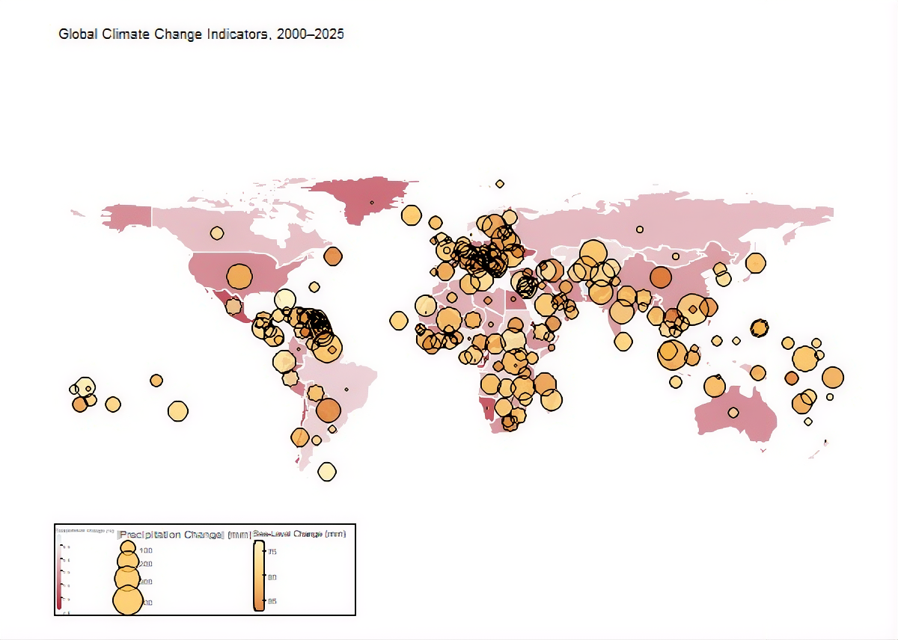
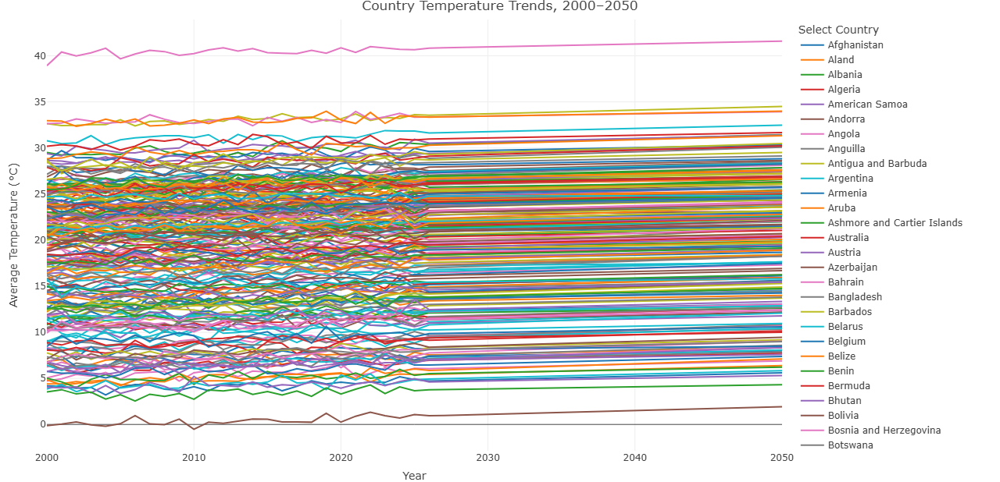
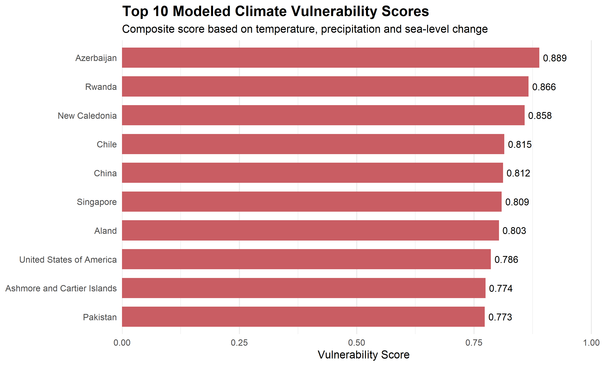

# Climate Change Impact Geospatial Analysis

A global climate analytics project using **R, spatial analysis, time-series modeling, predictive projections, and interactive visualization** to examine synthetic climate trends from 2000–2025 and modeled extensions through 2050.

> **Important:** This project uses synthetic climate data created for analytical and educational purposes. Projected values are model-based scenarios and should not be interpreted as authoritative real-world climate forecasts.

---

## Project Objective

Develop a multi-layered global climate analytics solution that combines geographic and temporal analysis to examine:

- Average temperature
- Precipitation
- CO₂ emissions
- Sea-level rise
- Country-level climate trends
- Historical changes from 2000–2025
- Model-based projections from 2026–2050
- Composite climate vulnerability

The project integrates climate indicators with global geographic boundaries to identify spatial patterns, explore relationships between indicators, and highlight entities experiencing greater modeled climate pressures.

---

## Environmental Problem

Climate indicators vary substantially across geographic regions and change over time.

Analyzing individual indicators independently can make it difficult to identify broader spatial and temporal patterns. This project therefore combines multiple climate indicators with geospatial analysis, time-series exploration, predictive modeling, and a synthetic vulnerability assessment.

The resulting workflow demonstrates how data visualization and geospatial analytics can be used to investigate complex environmental datasets.

---

## Analytical Scope

| Component | Scope |
|---|---|
| Historical period | 2000–2025 |
| Projection period | 2026–2050 |
| Geographic scope | Global |
| Geographic level | Country |
| Data type | Synthetic |
| Core indicators | Temperature, precipitation, CO₂ emissions, sea-level rise |
| Projection method | Country-level linear modeling |
| Spatial integration | ISO3 country codes |
| Vulnerability method | Composite percentile-based scoring |

---

## Key Visualizations

### Global Climate Indicators

The multi-layer map combines country-level climate information with precipitation and sea-level-change overlays.



---

### Global Temperature Animation

The project includes an animated global temperature visualization covering the historical and projected period from **2000–2050**.

**Animation:** [`global_temperature_2000_2050.gif`](global_temperature_2000_2050.gif)

---

### Interactive Country Temperature Trends

An interactive Plotly visualization allows country-level temperature trends to be explored across the 2000–2050 period.



Interactive HTML version:

[`interactive_country_temperature_trends.html`](outputs/figures/interactive_country_temperature_trends.html)

---

### Top Climate Vulnerability Entities

The vulnerability analysis combines multiple modeled climate-change indicators to identify entities with higher composite vulnerability scores.



---

## Project Workflow

1. Generated reproducible synthetic global climate data for 2000–2025.
2. Cleaned and validated country-level climate indicators and outliers.
3. Integrated climate data with global geographic boundaries using ISO3 codes.
4. Performed exploratory analysis of temperature, precipitation, CO₂ emissions, and sea-level change.
5. Built country-level linear models and generated projections for 2026–2050.
6. Constructed multi-layer geospatial maps and annual temperature animation.
7. Created interactive country-level temperature trend visualization.
8. Developed a composite modeled vulnerability analysis.

---

## Key Findings

- The synthetic dataset shows a modeled global average temperature increase of approximately **0.88°C from 2000 to 2025**.
- Modeled global mean sea-level rise increased by approximately **80 mm** over the historical period.
- Cross-country relationships between CO₂ emissions and climate indicators were weak within this synthetic dataset and should not be interpreted as causal relationships.
- The composite vulnerability analysis combines temperature change, absolute precipitation change, and sea-level change.
- **Azerbaijan, Rwanda, and New Caledonia** ranked among the highest modeled-vulnerability entities under the project's synthetic scoring framework.
- The 2026–2050 projections represent linear extensions of synthetic historical trends rather than authoritative real-world climate forecasts.

---

## Technical Stack

- **R** — analytical programming and statistical modeling
- **tidyverse** — data generation, transformation, cleaning, and aggregation
- **sf** — spatial data manipulation and geospatial integration
- **tmap** — thematic mapping and temporal climate visualization
- **rnaturalearth** — global geographic boundary data
- **plotly** — interactive country-level temperature visualization
- **broom** — model workflow support
- **magick** — assembly of annual map frames into the 2000–2050 temperature animation

---

## Methodology

### 1. Synthetic Data Generation

Historical climate observations were generated synthetically for 2000–2025 using reproducible random variation and predefined indicator trends.

The dataset contains:

- Country
- Year
- Average temperature
- Precipitation
- CO₂ emissions
- Sea-level rise

### 2. Data Cleaning

The generated dataset was validated and prepared for analysis, including country-level aggregation and outlier handling.

### 3. Geospatial Integration

Climate records were integrated with global country boundaries using ISO3 country codes.

### 4. Exploratory Analysis

Historical trends were examined across:

- Temperature
- Precipitation
- CO₂ emissions
- Sea-level rise
- Countries
- Regions
- Years

### 5. Projection Modeling

Country-level linear models were used to extend synthetic historical trends from **2026 through 2050**.

### 6. Geospatial Visualization

The project combines choropleth mapping, bubble overlays, color gradients, and temporal animation to communicate geographic climate patterns.

### 7. Vulnerability Analysis

A composite vulnerability score was constructed using equal-weight percentile ranks based on:

- Temperature change
- Absolute precipitation change
- Sea-level change

---

## Methodology & Limitations

This project is an analytical demonstration based on **synthetic data**.

The climate observations for 2000–2025 were generated synthetically rather than collected from real-world monitoring systems. The projection methodology assumes a linear continuation of historical synthetic patterns.

Therefore:

- The projections are **not climate forecasts**.
- The vulnerability scores are **not official country risk assessments**.
- The relationships observed in the synthetic dataset should not be interpreted as causal.
- The models do not incorporate complex climate-system interactions.
- Socioeconomic exposure, population, infrastructure, adaptive capacity, and nonlinear climate dynamics are outside the current modeling framework.

These limitations are important when interpreting the results.

---

## Project Structure

```text
Climate_Change_Geospatial_Analysis/
│
├── data/
│   ├── raw/
│   │   └── synthetic_climate_historical_2000_2025.csv
│   │
│   └── processed/
│       ├── climate_complete_2000_2050.csv
│       ├── climate_historical_clean.csv
│       ├── climate_projections_2026_2050.csv
│       └── country_climate_summary_2000_2025.csv
│
├── scripts/
│   ├── 01_generate_climate_data.R
│   ├── 02_clean_prepare_climate_data.R
│   ├── 03_geospatial_integration.R
│   ├── 04_exploratory_climate_analysis.R
│   ├── 05_climate_projection_modeling.R
│   ├── 06_climate_geospatial_visualization.R
│   └── 07_climate_vulnerability_analysis.R
│
├── outputs/
│   ├── figures/
│   │   ├── global-climate-indicators-2000-2025.png
│   │   ├── interactive-country-temperature-trends.png
│   │   ├── interactive_country_temperature_trends.html
│   │   └── top10_climate_vulnerability.png
│   │
│   └── tables/
│       ├── climate_vulnerability_scores.csv
│       ├── continent_vulnerability_summary.csv
│       ├── country_climate_change_2000_2025.csv
│       ├── global_annual_climate_trends_2000_2025.csv
│       ├── high_vulnerability_entities.csv
│       └── regional_climate_summary_2000_2025.csv
│
├── global_temperature_2000_2050.gif
├── Climate_Change_Impact_Geospatial_Analysis.pptx
└── README.md
